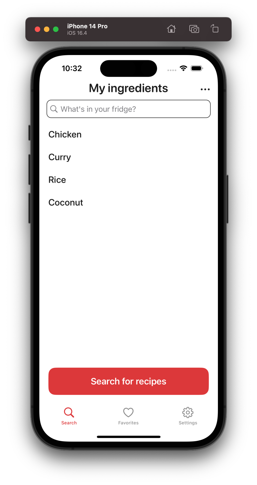
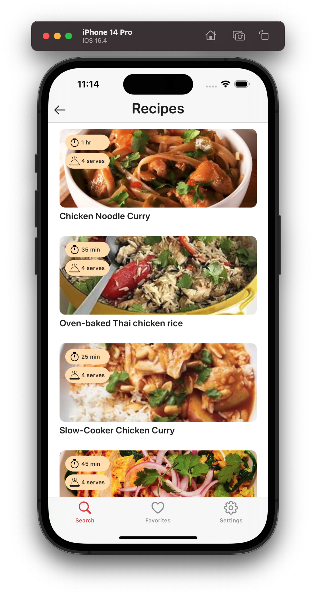
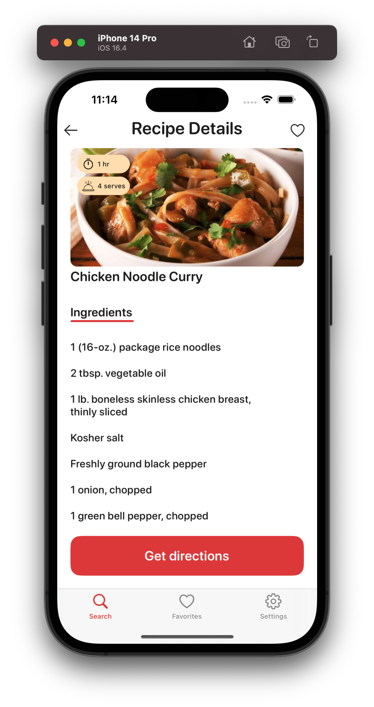
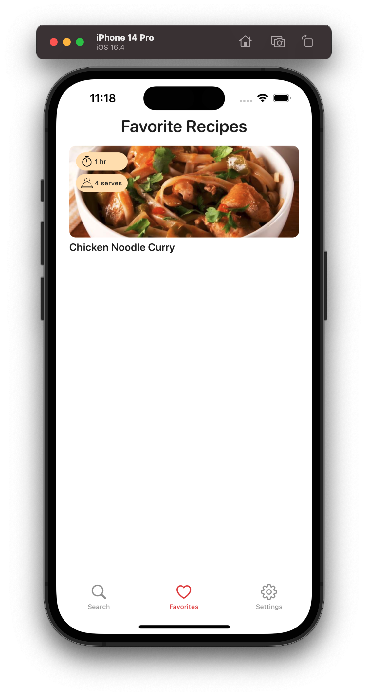
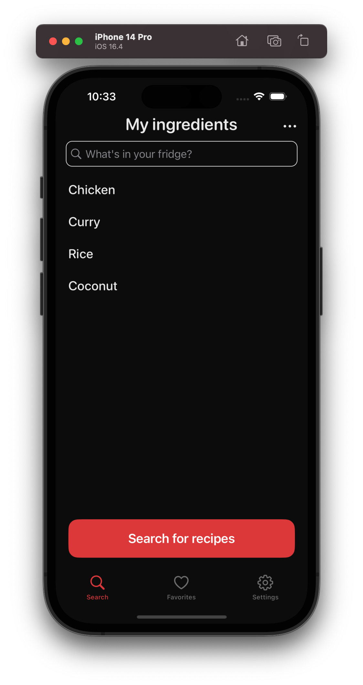
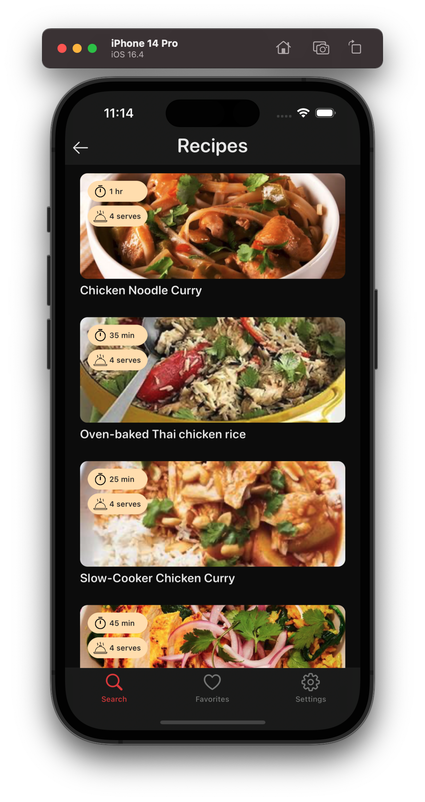
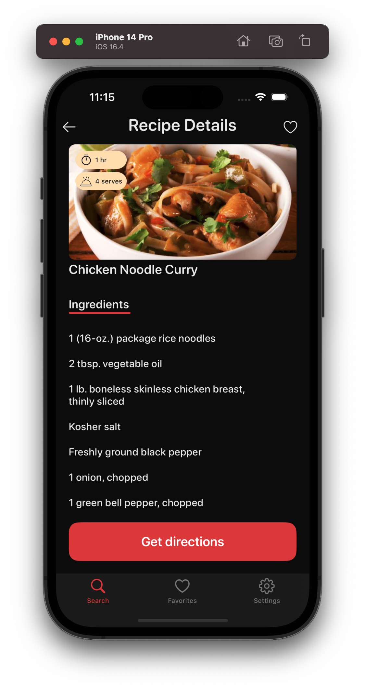
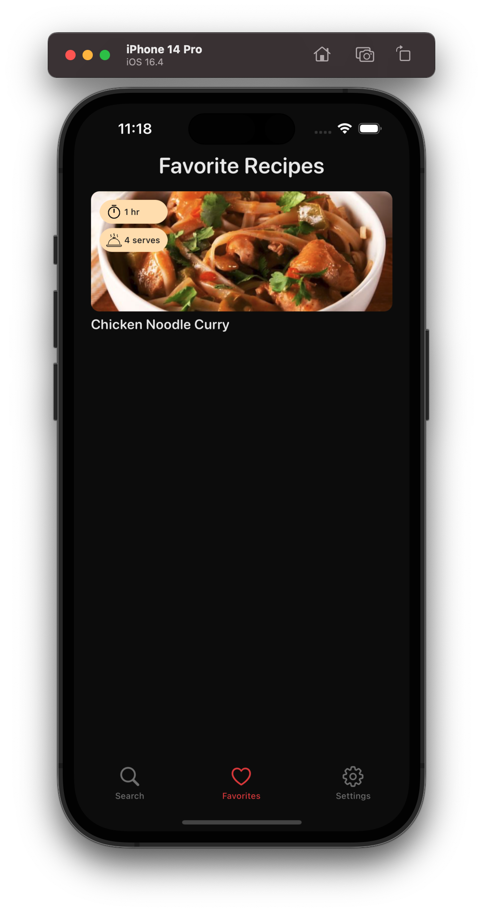

# CookItUp

CookItUp suggests recipes based on the ingredients in your fridge, making cooking easy and convenient. 
No more wondering what to cook - find delicious recipes using the ingredients you already have.

 

 

 

## Requirements

* iOS 16.4+

## Features

* Search tab
    * Autocompletion for ingredient search.
    * Menu for managing your ingredients list.
    * Recipe details view after searching.
    * Add recipes to your favorites.
    * Preserves your fridge ingredients list.

* Favorites tab
    * Display and manage your favorite recipes.
    * Persistent storage of favorite recipes.

* Settings tab
    * About section with application description.
    * Appearance mode customization.

* Other Features
    * iCloud synchronization and Background App Refresh.
    * Responsive layout for various iOS devices.
    * Optimized URL-cached responses and recipe ID-based image caching.
    * Improved VoiceOver accessibility with accessibilityLabel and accessibilityHint.

## Technologies Used

* Design Tools: Figma.
* API Integration: [Edamam](https://www.edamam.com/).
* UX/UI: UIKit, via storyboard and code.
* Asynchronous Operations: Concurrency (async/await) and Combine.
* Persistent Storage and Caching: CloudKit, Core Data, UserDefaults, FileManager, URLCache, NSCache.

## Usage

1. List your fridge ingredients using an autocomplete search.
2. Discover recipes based on your ingredients list.
3. Add the recipe(s) to your favorites list.
4. Learn how to cook a recipe by accessing all the details.
5. Easily return to your previous ingredient list and favorite recipes.
6. Share your recipe directions.

## Dependency

* This application uses [Alamofire 5.9+](https://cocoapods.org/pods/Alamofire)

## Architecture

* Clean Architecture + MVVM.
Inspired by [Oleh Kudinov's Medium article](https://tech.olx.com/clean-architecture-and-mvvm-on-ios-c9d167d9f5b3).

## License

All rights reserved.